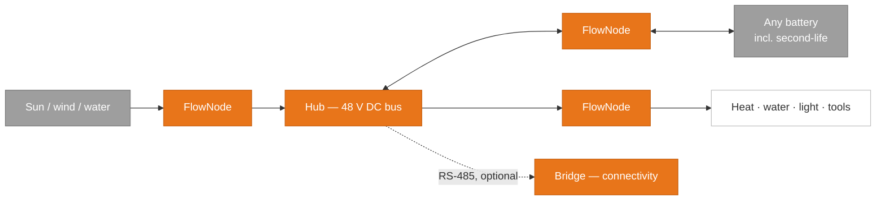

# Silojoule

**The open ecosystem for energy autonomy.**

Energy is the precondition for action — yet for most people it arrives through a single channel, on terms set by others. Silojoule is the open hardware and firmware ecosystem that inverts this: energy from sun, wind, or water, stored in any battery, powering any DC load — on a 48 V DC bus that you build, own, and understand.

## Why it is different

**Open · Repairable · Offline-first.** Three structural guarantees, not marketing claims.

**Open.** CERN-OHL-S v2 (hardware) and GPL v3 (firmware) — strong copyleft: anyone may build, modify, and sell, and derivatives stay open. The designs can outlive any company, including ours.

**Repairable.** Perfboard construction, socketed drivers, TO-220 FETs, solder-free where possible — every component replaceable down to the component level, native EU Right to Repair compliance.

**Offline-first.** Every core function runs without cloud, account, or internet. The optional SaaS layer adds convenience and funds development — removing it never disables a device.

**Polymorphic hardware.** The FlowNode is one converter design that takes on different roles through firmware — MPPT solar controller, bidirectional battery interface, programmable DC output. In software terms: same interface, behavior set at runtime. Supporting a new battery chemistry or energy source is a firmware problem, not a new device.

**Below 60 V DC (SELV).** No licensed electrician, no permit, no grid operator approval. Buildable in a barn, a van, a school, an island grid.

## Status

Early prototype development — schematics, firmware, and documentation are built in the open. The organization behind the project, Silojoule UG (haftungsbeschränkt) — distinct from the Silojoule Open ecosystem — is an ordinary commercial entity, not gemeinnützig: no investors, no data business, may later convert to a GmbH.

| | |
|---|---|
| Main repository | [silojoule-open](https://github.com/silojoule/silojoule-open) |
| Website | [silojoule.org](https://silojoule.org) |
| Contributing | use cases, schematic review, BMS protocol profiles — see [CONTRIBUTING](https://github.com/silojoule/silojoule-open/blob/main/CONTRIBUTING.md) |
